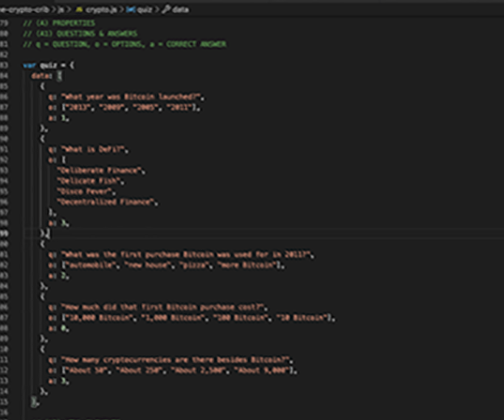
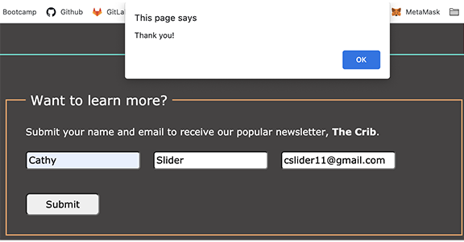

## The Crypto Crib

The files in this repository are the initial documents for a cryptocurrency website.

Access the site at http://thecryptocrib.com and be aware that this is not a secure site. It is advised that you do not enter live personal information in the form fields.

The following project requirements have been met:

- The site is responsive with media queries for tablet and mobile devices.
- There are at least 25 commits to the repository.
- There are four JavaScript requirements within the site as follows:

  1.  Current date is displayed at the top of the page, and there is a countdown timer displayed for an event in October:
      
  2.  An array was created, populated with multiple values which are all retrieved and displayed in the completed "How much did you learn?" quiz:
      
      
  3.  A form was created to collect name and email. A regular expression (regex) was used to verify the correct formatting of the email address with notification to the user of an Invalid email address!:
      
      or a confirmation message for a valid email address:
      
  4.  The same form, when submitted, will generate a local file in JSON format (cryptoFormData.txt) with the first name, last name, and email text:
      

Next steps for this project would be to develop the educational content and the sub pages as well as improving the functionality and design for an ideal user experience. 
 
Thank you very much to the Code Louisville mentors - Ryan, Michael, and Elise - for their commitment to helping with this project!
